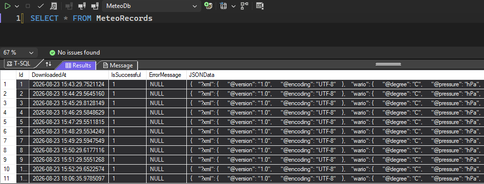

# ITIXO Meteostanice - ITIXO zkušební práce

Projekt stahuje XML data meteostanice z konfigurovatelné URL, převádí je na JSON a ukládá do SQL databáze spolu s časem stažení. Pokud meteostanice není dostupná, uloží se prázdný záznam s informací o nedostupnosti.

Hlavní features
- .NET Worker Service (hostovaný servis) — spuštěno jako background worker
- Konfigurovatelná URL (appsettings.json)
- Poskytnutou URL jsem si upravil na https://pastebin.com**/raw/**PMQueqDV, abych mohl stahovat rovnou čistý XML string
- Ukládání dat do SQL Serveru pomocí Entity Framework Core
- Automatické vytvoření databáze při prvním spuštění

<br>

**Požadavky**
- .NET 10 SDK
- SQL Server (connection string v appsettings.json)

<br>

**Konfigurace** \
<br>
V souboru `appsettings.json` nastavte connection string `DefaultConnection` a URL `DownloadUrl`
Příklad:
```
{
  "ConnectionStrings": {
    "DefaultConnection": "Server=.;Database=MeteoDb;Trusted_Connection=True;"
  },
  "MeteoSettings": {
    "Url": "https://pastebin.com/raw/PMQueqDV"
  }
}
```

<br>

**Spuštění**
- Lokálně v Visual Studio: otevřít solution `Meteostanice.slnx` a spustit projekt
- Nebo pomocí CLI:
  1. Otevřít terminal v root projektu (`C:\ITIXOMeteostanice`)
  2. `dotnet run --project ITIXOMeteostanice`

<br>

**Poznámky k databázi**
- DbContext se registruje a volá pomocí `Database.EnsureCreated()`, není potřeba ručně spouštět migrace
- Tabulka ukládá JSON payload, čas stažení, flag dostupnosti a případnou error message


<br>

**Chování při nedostupnosti meteostanice**
- Pokud je endpoint nedostupný nebo vrací chybu, aplikace uloží zápis `IsSuccessful 0` a error message zapíše do `ErrorMessage`

<br>

**Struktura projektu**
- `Meteostanice.Workers` - BackgroundService
- `Meteostanice.Data` - EF Core DbContext
- `Meteostanice.Models` - Model databáze
- `Meteostanice.Services` - Logika stahování a transformace

<br>

Strávený čas na projektu:
Přibližně 6 hodin
